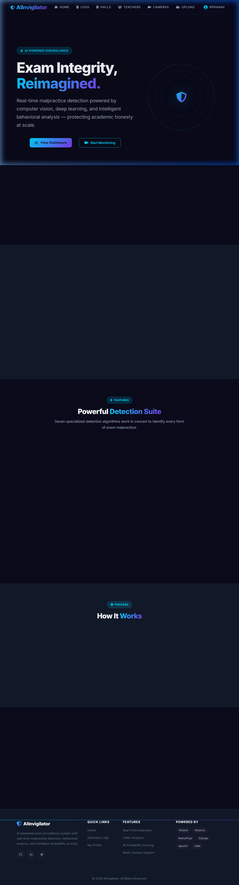
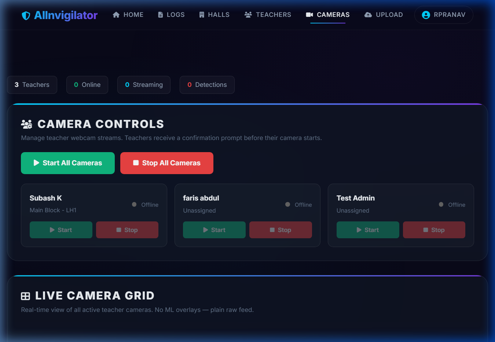
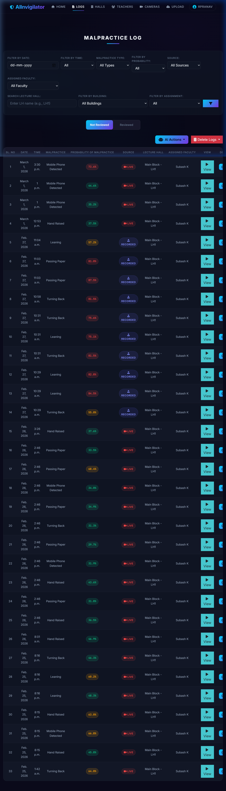
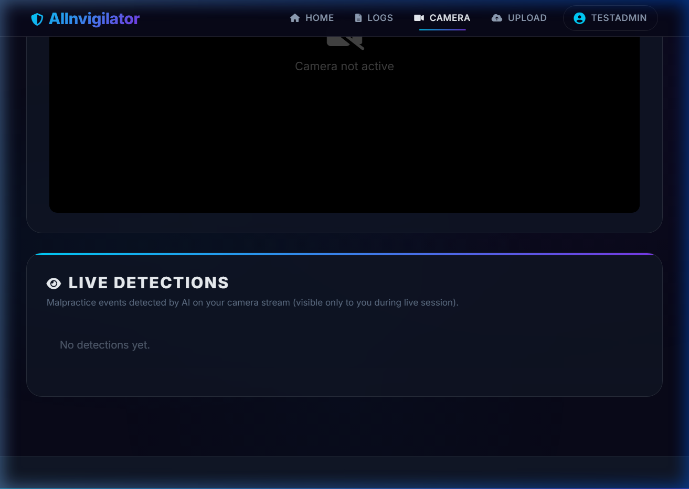

<p align="center">
  
</p>

<h1 align="center">🛡️ AIInvigilator</h1>

<p align="center">
  <b>Real-time AI-Powered Exam Surveillance System</b><br/>
  <i>Detecting malpractice using computer vision, deep learning, and intelligent behavioral analysis</i>
</p>

<p align="center">
  
  
  
  
  
  
  
  
  
  
</p>

---

## 📸 Screenshots

<table>
  <tr>
    <td align="center"><b>Landing Page</b></td>
    <td align="center"><b>Admin Camera Management</b></td>
  </tr>
  <tr>
    <td></td>
    <td></td>
  </tr>
  <tr>
    <td align="center"><b>Malpractice Detection Log</b></td>
    <td align="center"><b>Teacher Camera View</b></td>
  </tr>
  <tr>
    <td></td>
    <td></td>
  </tr>
</table>

---

## 🎯 What is AIInvigilator?

AIInvigilator is a comprehensive **AI-powered exam surveillance system** that uses **computer vision** and **deep learning** to detect malpractice in real-time during classroom examinations. It supports both **live webcam monitoring** and **pre-recorded video analysis**, providing administrators with actionable intelligence through probability-scored detections and video evidence.

### Key Highlights
- 🔍 **7 Malpractice Types Detected** — Mobile phone usage, turning back, leaning, hand raising, paper passing, and more
- 📹 **Dual Mode** — Live camera streaming with real-time ML processing + recorded video upload analysis
- 🖥️ **Multi-Camera Grid** — Admin can monitor all teacher cameras simultaneously in a grid view
- 🧠 **GPU-Accelerated ML** — 3x faster processing with NVIDIA CUDA (RTX 3050 tested at 14 ML FPS)
- 📊 **Probability Scoring** — Each detection has an intelligent probability score based on confidence, duration, density, and sustainability
- 🎥 **Video Evidence** — Automatic recording of malpractice events with 5-second clips
- 🔔 **Real-time Notifications** — WebSocket-based instant communication between admin and teachers
- 🌐 **Network Access** — Teachers connect from any device on the same WiFi — no installation needed

---

## 🏗️ Architecture

```
┌──────────────────────────────────────────────────────────────────┐
│                        ADMIN BROWSER                             │
│  ┌─────────────────┐  ┌─────────────────┐  ┌──────────────────┐ │
│  │ Camera Controls  │  │  Live Grid View  │  │ Malpractice Log  │ │
│  │ Start/Stop/Retry │  │  Binary Frames   │  │ Filters + Video  │ │
│  └────────┬────────┘  └────────┬────────┘  └──────────────────┘ │
│           │ WebSocket           │ WebSocket                      │
└───────────┼─────────────────────┼────────────────────────────────┘
            │                     │
┌───────────┴─────────────────────┴────────────────────────────────┐
│                      DJANGO SERVER (ASGI/Daphne)                 │
│  ┌──────────────────┐  ┌──────────────────┐  ┌────────────────┐ │
│  │NotificationConsumer│  │CameraStreamConsumer│  │AdminGridConsumer│ │
│  │ Camera requests   │  │ Frame processing │  │ Frame relay    │ │
│  │ Status updates    │  │ ML inference     │  │ Binary forward │ │
│  └──────────────────┘  └────────┬─────────┘  └────────────────┘ │
│                                 │                                │
│            ┌────────────────────┴──────────────────┐             │
│            │         ML PROCESSING PIPELINE        │             │
│            │  ┌──────────┐  ┌───────────────────┐  │             │
│            │  │ YOLOv8n  │  │   YOLOv11n-pose   │  │             │
│            │  │  Object  │  │  Pose Estimation  │  │             │
│            │  │Detection │  │  (17 keypoints)   │  │             │
│            │  └──────────┘  └───────────────────┘  │             │
│            │        GPU: NVIDIA CUDA               │             │
│            └───────────────────────────────────────┘             │
│                                                                  │
│  ┌─────────────┐  ┌───────────────┐  ┌────────────────────────┐ │
│  │   MySQL DB   │  │  Redis Cache  │  │    Media Storage       │ │
│  │  Sessions    │  │  Channel      │  │  Videos / Frames       │ │
│  │  Detections  │  │   Layer       │  │  Evidence Clips        │ │
│  └─────────────┘  └───────────────┘  └────────────────────────┘ │
└──────────────────────────────────────────────────────────────────┘
            │
┌───────────┴──────────────────────────────────────────────────────┐
│                      TEACHER BROWSERS                            │
│  ┌────────────────┐  ┌────────────────┐  ┌────────────────────┐ │
│  │  Teacher 1      │  │  Teacher 2      │  │  Teacher N         │ │
│  │  Webcam Stream  │  │  Webcam Stream  │  │  Webcam Stream     │ │
│  │  ML Overlay     │  │  ML Overlay     │  │  ML Overlay        │ │
│  │  Stop Button    │  │  Stop Button    │  │  Stop Button       │ │
│  └────────────────┘  └────────────────┘  └────────────────────┘ │
└──────────────────────────────────────────────────────────────────┘
```

---

## 🔍 Malpractice Detection Types

| # | Type | Detection Method | Model Used |
|---|------|------------------|------------|
| 1 | **Mobile Phone Usage** | Object detection for phones/devices | YOLOv8n |
| 2 | **Turning Back** | Shoulder angle analysis using pose keypoints | YOLOv11n-pose |
| 3 | **Leaning** | Body posture ratio (shoulder-to-hip angle deviation) | YOLOv11n-pose |
| 4 | **Hand Raising** | Wrist-above-shoulder detection using keypoints | YOLOv11n-pose |
| 5 | **Paper Passing** | Combined hand position + proximity analysis | YOLOv11n-pose |
| 6 | **Looking Around** | Head pose estimation via nose-shoulder alignment | YOLOv11n-pose |
| 7 | **Suspicious Movement** | Rapid body movement detection | YOLOv11n-pose |

### Probability Scoring System

Each detection receives a probability score (0-100%) calculated using a weighted formula:

| Factor | Weight | Description |
|--------|--------|-------------|
| Duration | 30% | How long the malpractice was sustained |
| Density | 25% | How consistently it appeared in frames |
| Confidence | 20% | ML model's confidence score |
| Sustainability | 15% | Consecutive frame detection count |
| Type Prior | 10% | Base probability for the malpractice type |

---

## 🚀 Features

### For Admin
- 📊 **Dashboard** — Overview of all teachers, online status, active streams, detection count
- 🎮 **Camera Controls** — Start/stop individual or all teacher cameras with one click
- 📺 **Live Camera Grid** — Real-time view of all active teacher webcams
- 📋 **Malpractice Log** — Filterable log with probability scores, timestamps, video proof
- 🔄 **Error Handling + Retry** — If a teacher's camera fails, admin gets a toast notification with a "Retry" button
- 👥 **Teacher Management** — Assign teachers to lecture halls, track online/offline status

### For Teachers
- 📷 **Camera View** — Live webcam preview with ML skeleton overlay
- 🛑 **Stop Camera** — Teacher can stop their own camera at any time
- 🔔 **Real-time Notifications** — Receive camera requests from admin, with accept/deny
- 📈 **Live Detections** — See real-time detection events on their screen
- 🔌 **Auto-Reconnect** — WebSocket auto-reconnects after network glitches or laptop sleep

### Technical Features
- ⚡ **GPU Acceleration** — CUDA-powered inference on NVIDIA GPUs (3x speedup)
- 🔄 **Binary WebSocket Protocol** — High-performance frame streaming to admin grid
- 💾 **H.264 Video Encoding** — Browser-compatible video evidence clips
- 🔒 **Session Management** — Race condition protection, deduplication, heartbeat monitoring
- 🌐 **LAN Access** — Multiple devices can connect via WiFi without any installation
- 🗄️ **Redis Channel Layer** — Production-grade WebSocket backend replacing in-memory layer
- 📨 **Celery Task Queue** — Reliable background email/SMS notifications with retry logic
- 🔗 **DB Connection Pooling** — SQLAlchemy-backed MySQL connection pool (10 persistent + 20 overflow)
- 🧪 **Automated Testing** — 45 pytest tests covering models, views, and tasks
- 🔁 **CI/CD Pipeline** — GitHub Actions with automated testing, linting, and Docker builds

---

## 📋 Prerequisites

| Requirement | Minimum | Recommended |
|-------------|---------|-------------|
| **OS** | Windows 10 / Ubuntu 20.04 | Windows 11 |
| **Python** | 3.10 | 3.11+ |
| **CPU** | 4 cores | 8+ cores |
| **RAM** | 8 GB | 16 GB |
| **GPU** | — (CPU works) | NVIDIA GPU with 4GB+ VRAM |
| **Database** | MySQL 8.0 | MySQL 8.0 |
| **Browser** | Chrome / Edge | Chrome / Edge / Brave |
| **Webcam** | 720p | 1080p |

### Software Dependencies
- Python 3.10+
- MySQL Server 8.0+
- Docker Desktop (for Redis container)
- Git
- NVIDIA CUDA Toolkit 12.1 (optional, for GPU acceleration)

---

## ⚡ Installation & Setup

### 1. Clone the Repository

```bash
git clone https://github.com/SarangSanthosh/AIInvigilator.git
cd AIInvigilator
```

### 2. Create Virtual Environment (Recommended)

```bash
python -m venv venv

# Windows
.\venv\Scripts\activate

# Linux / Mac
source venv/bin/activate
```

### 3. Install Dependencies

```bash
pip install -r requirements.txt
```

> **GPU Users:** If you have an NVIDIA GPU, install PyTorch with CUDA support:
> ```bash
> pip install torch torchvision torchaudio --index-url https://download.pytorch.org/whl/cu121
> ```

### 4. Configure Environment Variables

Create a `.env` file in the project root (or edit the existing one):

```env
# Database
DB_NAME=aiinvigilator
DB_USER=root
DB_PASSWORD=your_mysql_password
DB_HOST=localhost
DB_PORT=3306

# GPU Configuration
USE_GPU=True
GPU_DEVICE_ID=0
USE_HALF_PRECISION=False
CUDA_BENCHMARK=True

# Timezone
TIME_ZONE=Asia/Kolkata
```

### 5. Setup Database

```bash
# Create the MySQL database
mysql -u root -p -e "CREATE DATABASE aiinvigilator;"

# Run Django migrations
python manage.py makemigrations
python manage.py migrate
```

### 6. Create Admin User

```bash
python manage.py createsuperuser
```

### 7. Start Redis (Docker)

Redis is required for WebSocket communication (Django Channels) and Celery task queue.

```bash
# Make sure Docker Desktop is running, then:
docker run -d --name redis -p 6379:6379 --restart unless-stopped redis:7-alpine

# Verify it's running:
docker exec redis redis-cli ping
# Should return: PONG
```

> Redis starts automatically whenever Docker Desktop is running (`--restart unless-stopped`).

---

## 🏃 Running the Application

### Start the Server

```bash
# Local only (your machine only)
python manage.py runserver

# Network access (other devices on same WiFi can connect)
python manage.py runserver 0.0.0.0:8000
```

### Start Celery Worker (Optional — for background notifications)

In a **separate terminal** (same directory as `manage.py`):

```bash
celery -A app worker --pool=solo --loglevel=info
```

> The Celery worker processes background email/SMS notifications. The app works without it, but notifications will queue until a worker starts.

### Run Tests

```bash
pytest tests/ -v
```

### Access the App

| URL | Purpose |
|-----|---------|
| `http://localhost:8000/` | Landing page |
| `http://localhost:8000/login/` | Login page |
| `http://localhost:8000/run_cameras/` | Admin — Camera management |
| `http://localhost:8000/malpractice_log/` | Admin — Detection logs |
| `http://localhost:8000/teacher_cameras/` | Teacher — Camera view |
| `http://localhost:8000/upload_video/` | Upload recorded video for analysis |

> **For network access:** Replace `localhost` with your machine's IP (e.g., `192.168.29.69`). Find it with `ipconfig` (Windows) or `ifconfig` (Linux).

---

## 🖥️ Demo Setup (Multi-Device)

Perfect for project demonstrations — your friends/classmates can connect from their own devices!

### What You Need
- ✅ **1 laptop** running the server (with the project installed)
- ✅ **All devices on the same WiFi network**
- ✅ **Friends only need a browser** — Chrome, Edge, or Brave on phone/laptop
- ❌ **Friends do NOT need to install anything**

### Steps

1. **Find your IP address:**
   ```bash
   ipconfig    # Windows
   ifconfig    # Linux
   ```
   Note the WiFi adapter's **IPv4 Address** (e.g., `192.168.29.69`)

2. **Start the server with network access:**
   ```bash
   python manage.py runserver 0.0.0.0:8000
   ```

3. **Tell friends to open their browser and go to:**
   ```
   http://YOUR_IP:8000/
   ```

4. **Demo flow:**
   - **Admin** logs in → goes to Cameras → clicks **"Start All Cameras"**
   - **Teachers** log in on their devices → get popup → click **Accept**
   - Webcam turns on → ML processing starts → Admin sees live grid
   - Teachers can perform malpractice actions → Detections appear in logs
   - Teachers can click **"Stop Camera"** to stop their feed

---

## 📁 Project Structure

```
AIInvigilator/
├── app/                          # Django application
│   ├── consumers.py              # WebSocket consumers (notifications, streaming, grid)
│   ├── models.py                 # Database models (CameraSession, MalpracticeDetection, etc.)
│   ├── views.py                  # HTTP views (pages, API endpoints)
│   ├── urls.py                   # URL routing
│   ├── settings.py               # Django configuration (Redis, Celery, DB pooling)
│   ├── routing.py                # WebSocket URL routing
│   ├── celery.py                 # Celery app configuration & autodiscovery
│   ├── tasks.py                  # Background tasks (email/SMS notifications)
│   └── utils.py                  # Helper functions (SMS, email utilities)
│
├── ML/                           # Machine Learning pipeline
│   ├── frame_processor.py        # Core ML processing (YOLO inference, detection logic)
│   ├── gpu_config.py             # GPU/CUDA configuration and optimization
│   ├── process_video.py          # Recorded video analysis pipeline
│   └── models/                   # YOLO model weights
│       ├── yolov8n.pt            # Object detection (mobile phones)
│       └── yolo11n-pose.pt       # Pose estimation (17 keypoints)
│
├── templates/                    # HTML templates
│   ├── index.html                # Landing page
│   ├── login.html                # Authentication
│   ├── run_cameras.html          # Admin camera management + grid
│   ├── teacher_cameras.html      # Teacher camera view + ML overlay
│   ├── malpractice_log.html      # Detection log with filters
│   └── upload_video.html         # Video upload interface
│
├── tests/                        # Automated test suite (pytest)
│   ├── conftest.py               # Shared fixtures (users, halls, logs)
│   ├── test_models.py            # 16 model tests (CRUD, FK, indexes)
│   ├── test_views.py             # 24 view tests (auth, CRUD, permissions)
│   └── test_tasks.py             # 5 Celery task tests (mocked email/SMS)
│
├── .github/workflows/ci.yml      # CI/CD pipeline (GitHub Actions)
├── static/                       # Static assets (CSS, JS, images)
├── media/                        # Uploaded videos and evidence clips
├── .env                          # Environment configuration
├── pytest.ini                    # Pytest configuration
├── requirements.txt              # Python dependencies
├── manage.py                     # Django management script
└── README.md                     # This file
```

---

## 🛠️ Tech Stack

| Layer | Technology |
|-------|-----------|
| **Backend** | Django 6.0, Daphne (ASGI) |
| **WebSockets** | Django Channels, Redis 7 (Docker) |
| **Task Queue** | Celery 5.6 with Redis broker |
| **ML/AI** | YOLOv8, YOLOv11, Ultralytics, PyTorch |
| **GPU** | NVIDIA CUDA 12.1, cuDNN |
| **Database** | MySQL 8.0 with SQLAlchemy connection pooling |
| **Frontend** | HTML5, CSS3, JavaScript (Vanilla) |
| **Video** | OpenCV, H.264 encoding |
| **Testing** | pytest 9.0, pytest-django, 45 automated tests |
| **CI/CD** | GitHub Actions (test + Docker build) |
| **Fonts/Icons** | Google Fonts (Inter), FontAwesome |

---

## ⚙️ GPU Performance

Tested on NVIDIA GeForce RTX 3050 6GB Laptop GPU:

| Metric | CPU Only | GPU (FP32) |
|--------|----------|------------|
| Pose Detection | ~12 FPS | ~28 FPS |
| Object Detection | ~10 FPS | ~27 FPS |
| Combined (both models) | ~5 FPS | **~14 FPS** |
| Teacher ML Overlay | ~5 FPS | **~14 FPS** |
| Admin Grid FPS | ~3 FPS | **~10 FPS** |

> GPU provides a **~3x speedup** over CPU-only processing.

---

## 🔐 Security Notes

For production deployment, make sure to:
- Set `DEBUG = False` in `settings.py`
- Configure `ALLOWED_HOSTS` with specific domain/IP
- Use HTTPS with SSL certificates
- Change `SECRET_KEY` to a unique value
- Set Redis to require authentication (`requirepass`)
- Use environment variables for all secrets (`.env` file)
- Run Celery worker with limited concurrency in production

---

## 🧪 Testing & CI/CD

### Automated Test Suite

The project includes **45 automated tests** organized into 3 test files:

| File | Tests | Coverage |
|------|-------|----------|
| `tests/test_models.py` | 16 | Models, FK constraints, CASCADE/SET_NULL, indexes, ordering |
| `tests/test_views.py` | 24 | Auth, permissions, CRUD, filters, JSON responses |
| `tests/test_tasks.py` | 5 | Celery tasks with mocked email/SMS services |

```bash
# Run all tests
pytest tests/ -v

# Run specific test file
pytest tests/test_models.py -v

# Run with coverage
pytest tests/ -v --tb=short
```

### CI/CD Pipeline (GitHub Actions)

Every push to `main` and every pull request triggers:

1. **Test Job** — Spins up Redis + MySQL services, installs dependencies, runs migrations, executes all 45 tests
2. **Docker Build Job** — Builds the Docker image and caches layers (runs only on push to `main` if tests pass)

Pipeline config: `.github/workflows/ci.yml`

---

## 🤝 Contributing

1. Fork the repository
2. Create a feature branch (`git checkout -b feature/your-feature`)
3. Commit your changes (`git commit -m 'Add your feature'`)
4. Push to the branch (`git push origin feature/your-feature`)
5. Open a Pull Request

---

## 📄 License

This project is developed for **educational purposes** as part of an academic project.

---

## 👥 Team

Built with ❤️ by the AIInvigilator team.

---

<p align="center">
  <b>⭐ Star this repo if you found it useful!</b>
</p>
